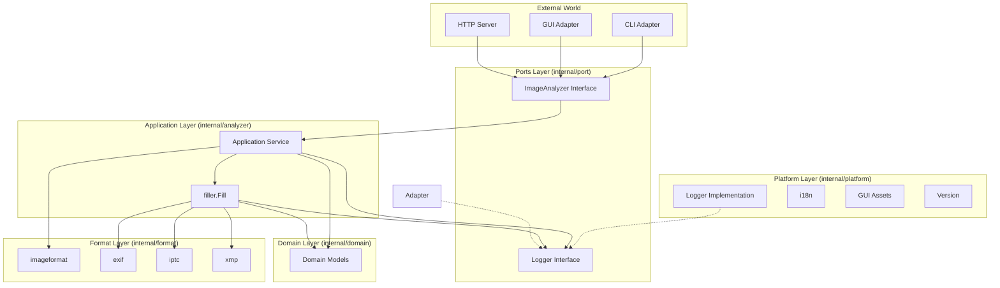

# Architecture Overview

PhotoMeta is built using the **Hexagonal Architecture** (also known as Ports and Adapters). This pattern emphasizes separating the core application logic (the "Inside") from external concerns (the "Outside") through defined interfaces.

## 1. Domain Layer (`internal/domain`)
The heart of the application. It contains pure Go structs representing the business entities, independent of any framework or external library.

*   **Models**: `ImageFile`, `Metadata`, etc. define the data structure for image analysis results.

## 2. Ports Layer (`internal/port`)
Defines the contracts (interfaces) for interaction between the external world and the application core.

*   **Input Port**: `ImageAnalyzer` interface defines the operations available to the outside world (e.g., `ScanDirectory`, `AnalyzeStream`).

## 3. Application Layer (`internal/analyzer`)
Implements the Input Ports. This layer contains the application logic, orchestrating the flow of data and using domain models. It acts as the "Service" layer.

*   **Service**: Concrete implementation of `ImageAnalyzer`. It orchestrates the format detection and metadata extraction using custom parsers from the `internal/format` packages.
*   **filler**: Package responsible for extracting metadata from image segments and filling domain models.

## 4. Adapters Layer (`internal/adapter`)
Contains the implementations that drive the application (Driving Adapters) or are driven by it (Driven Adapters).

*   **CLI**: Command-line interface adapter.
*   **GUI**: Graphical interface adapter using Fyne.
*   **HTTP**: Web server adapter exposing the functionality via REST API.

## 5. Format Layer (`internal/format`)
Contains custom metadata parsers and format detection logic. These are internal implementation details.

*   **imageformat**: Format detection (JPEG, PNG, WebP, TIFF, GIF)
*   **exif**: EXIF metadata parser
*   **iptc**: IPTC metadata parser
*   **xmp**: XMP metadata parser

## 6. Platform Layer (`internal/platform`)
Contains technical capabilities that support the application layers.

*   **logger**: Structured logging implementation using Go's `log/slog`
*   **locale**: Internationalization support (6 languages)
*   **assets**: Static resources for GUI (icons, etc.)
*   **version**: Version information injected at build time via ldflags

## 7. Test Infrastructure

*   **`internal/fake/`**: Test doubles that implement interfaces from `internal/port`. Used for unit testing without external dependencies.
*   **`integration/`**: Integration tests that verify cross-layer interactions.
